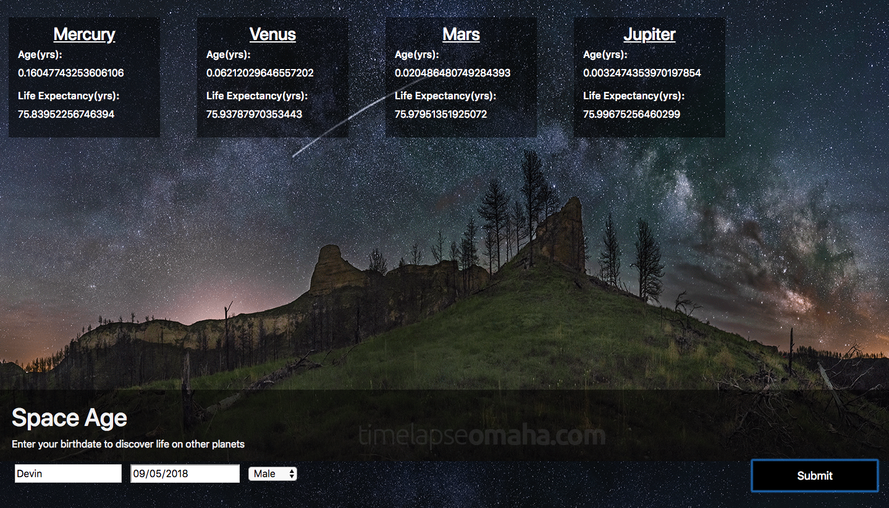

# Planetary Life

#### Epicodus JavaScript: Wk 1 Independent Project, 08/03/2018

#### By Devin Mounts

## Splash

## Description

A web app that allows a user to enter their birthday and see how old they are on other planets based on the length of various planetary years.

## Setup on OSX

* Install Node.js
* Install karma-cli globally: `npm install -g karma-cli`
* Clone the repo
* `npm install` to install dependencies
* `npm run start` to build and start the dev server
* `npm run lint` to explicitly run ESLint
* `npm run test` to run the unit tests with Karma and Jasmine. Visit `localhost:9876` to view the tests.

## Specs
1. Program converts a users age into seconds.
1. Program takes two dates and determines the difference, in seconds, between the two.
1. Program returns the age of user in Mercury years. (A Mercury year is .24 Earth years.)
1. Program returns the age of a human in Venus years. (A Venus year is .62 Earth years.)
1. Program returns the age of a human in Mars years. (A Mars year is 1.88 Earth years.)
1. Program returns the age of a human in Jupiter years. (A Jupiter year is 11.86 Earth years.)
1. Program returns how many years a user has left to live on each planet based on life expectancy, or the number of years the user has lived past the life expectancy.

## Contribution Requirements

1. Clone the repo
1. Make a new branch
1. Commit and push your changes
1. Create a PR

## Technologies Used

* JavaScript
* jQuery 3.3.1
* Node.js
* Bootstrap 4.1.3

## License

This software is licensed under the MIT license.

Copyright (c) 2018 **Devin Mounts**
